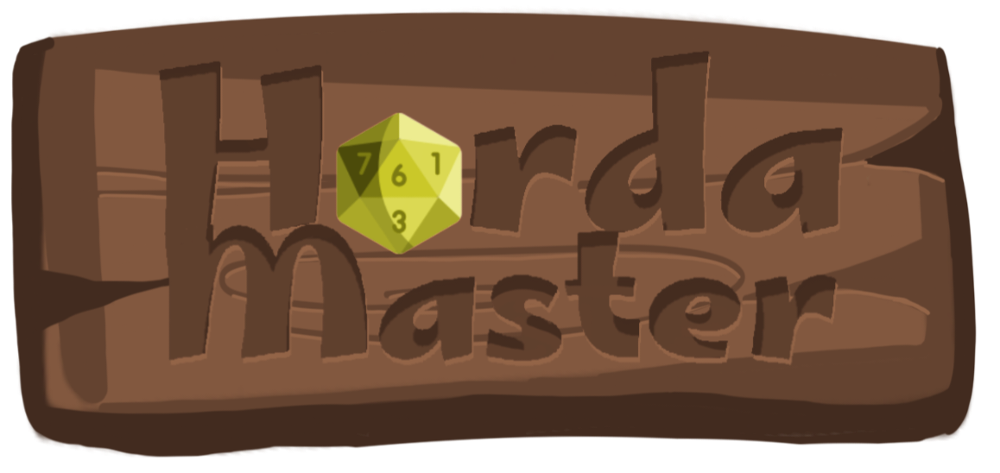

<div align="center">
  
</div>

# HordaMaster 


O **HordaMaster** é uma aplicação web criada para facilitar a vida de mestres de RPG de mesa, ajudando a gerenciar **múltiplos inimigos em combate** de forma organizada, prática e em tempo real.

📚 **RPG**, do inglês _Role Playing Game_, é um jogo de interpretação de papéis, onde um grupo de pessoas cria uma história em conjunto. Um narrador — chamado de **mestre** — descreve o mundo, cria desafios e controla criaturas e inimigos que os jogadores enfrentam. Durante os combates, o mestre costuma administrar várias criaturas ao mesmo tempo, o que pode ser confuso quando feito apenas em papel ou planilhas.

✨ O **HordaMaster** resolve esse problema permitindo:

- Criar **fichas** de inimigos com nome, nível, pontos de vida, classe de armadura e informações adicionais.
- Adicionar múltiplas cópias de inimigos numeradas automaticamente (ex.: Goblin 1, Goblin 2, Goblin 3).
- Gerenciar a vida de cada inimigo em tempo real direto na tela.
- Consultar informações básicas de monstros usando a API [5e SRD API](https://www.dnd5eapi.co/).

## 🚀 Tecnologias utilizadas

- **Vite**
- **React**
- **TailwindCSS**
- **uuid**
- **HTML5**
- **CSS3**
- **Icons:** Alguns ícones foram obtidos no [Freepik](https://www.freepik.com/); demais artes foram desenhadas por mim.

## ⚙️ Estrutura de Páginas

### 📌 Página Principal

- Visualiza todas as fichas criadas.
- Adiciona instâncias de cada ficha ao **grid de combate**, com numeração automática.
- Gerencia vida e status de cada inimigo individualmente.

### ✏️ Página Criar Ficha

- Cria novas fichas de inimigos ou apaga fichas antigas.
- Campos: Nome, Nível, Vida, CA, Ícone, Informações adicionais.
- As fichas salvas ficam disponíveis na tela principal em **Minhas Fichas**.

### ℹ️ Página Sobre

- Explica o objetivo do HordaMaster.
- Orienta mestres e novos usuários sobre o funcionamento.
- Informa sobre o uso da 5e SRD API.

## 🔗 Documentação da API Utilizada

O **HordaMaster** usa a [5e SRD API](https://www.dnd5eapi.co/):

- **Licença:** MIT License para a API; dados sob _Open Game License (OGL)_.
- **Autenticação:** Não requer cadastro ou chave de acesso (API Key).

### Endpoints Utilizados

| Método | Endpoint                     | Descrição                       |
| ------ | ---------------------------- | ------------------------------- |
| `GET`  | `/api/2014/monsters`         | Retorna lista de monstros.      |
| `GET`  | `/api/2014/monsters/{index}` | Retorna detalhes de um monstro. |

## 📥 Como Instalar e Executar

```bash
git clone https://github.com/maisepmaya/front-end-avancado-pucrio.git
cd front-end-avancado-pucrio
npm install
npm run dev
```

Acesse no navegador: `http://localhost:5173`.

## 🐳 Executando com Docker

Para executar o projeto utilizando Docker, siga os passos abaixo. A aplicação estará disponível em `http://localhost:3000`.

1.  **Construa a imagem Docker:**
    ```bash
    docker build -t hordamaster .
    ```

2.  **Execute o contêiner:**
    ```bash
    docker run -p 3000:3000 hordamaster
    ```

## ⚔️ Funcionalidades

✅ Criação de fichas  
✅ Edição e exclusão de fichas  
✅ Adição de inimigos ao grid com numeração automática  
✅ Gerenciamento de vida em tempo real  
✅ Integração com a 5e SRD API  
✅ Interface intuitiva e divertida

##

Projeto da **Pós-Graduação em Desenvolvimento Full-Stack** - **PUC-Rio**.
